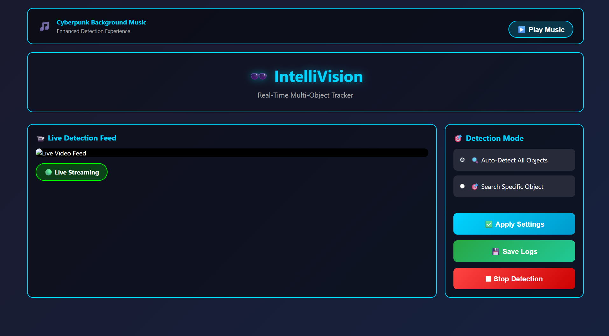
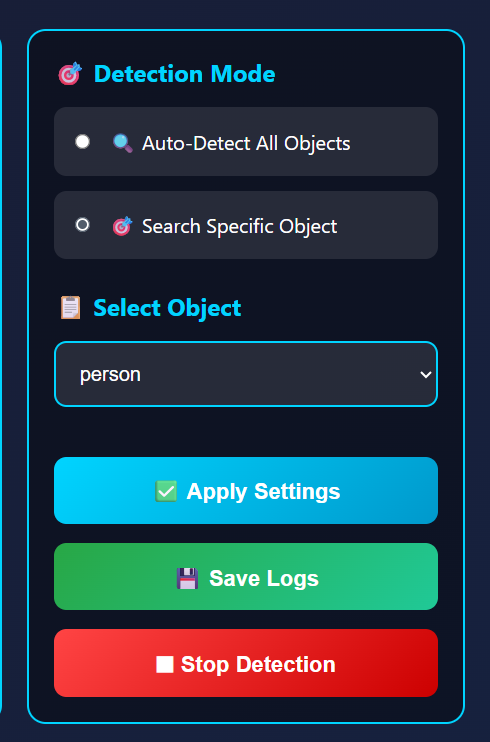
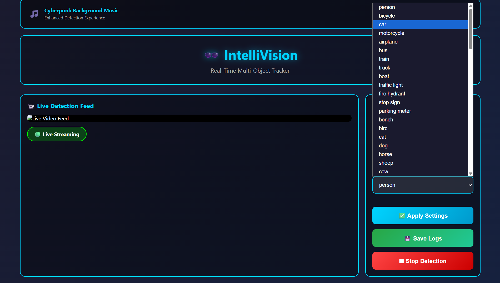
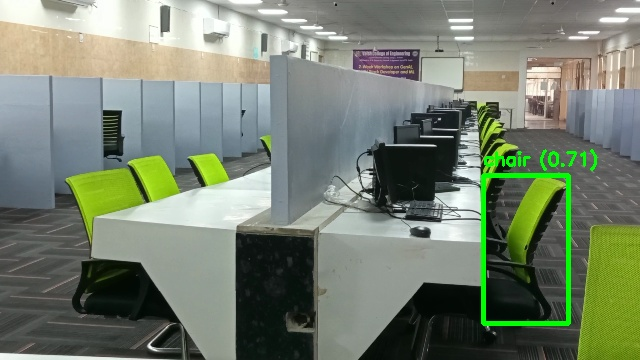
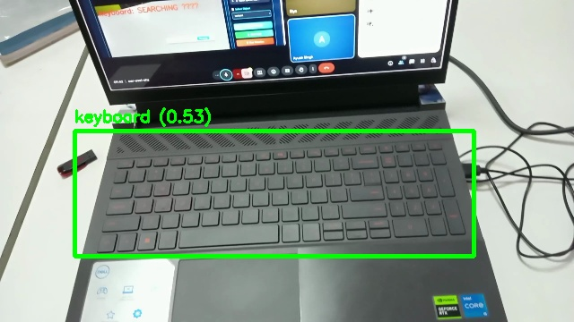
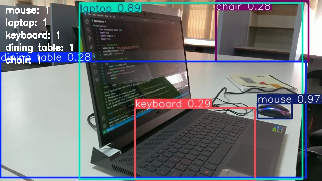

# IntelliVision → Real-Time Multi-Object Tracker  
AI-Powered Real-Time Object Detection & Tracking using **YOLOv8**, **Flask** and **OpenCV**

---

## ⚡ Overview  
**IntelliVision** is a real-time multi-object detection and tracking system built using **YOLOv8** and deployed through a **Flask web interface**.  
The system supports **local webcams**, **IP cameras**, multiple detection modes and logs real-time tracking insights — all within a clean and intuitive web UI.

This project was created for our **College Exhibition**, where I served as the **Team Leader**.  
I handled the **core technical development**:  
- YOLOv8 model integration  
- Flask backend  
- Real-time multi-object tracking pipeline  
- Error-handling & camera connectivity logic  

My teammates contributed to **UI ideas, documentation and the presentation**.

---

## ✨ Features  
- 🧠 **Real-Time YOLOv8 Object Detection**  
- 🎯 **Auto Mode + Target-Based Search Mode**  
- 🧍 **Multi-Object Tracking**  
- 📷 **Local Webcam Support (0 / CAP_DSHOW)**  
- 🌐 **IP Camera Stream Support**  
- 📊 **Live FPS Counter**  
- 📁 **Detection Logs (Timestamp, class, confidence, bbox)**  
- 🔧 **Confidence Threshold Adjustment**  
- ⚡ **Optimized for GPU (CUDA) when available**  
- 🛡️ **Advanced Error Handling**  
- 🌍 **Flask Web UI for Live Preview**  

---

## 🧰 Tech Stack  
**Backend:** Flask, Python  
**AI Model:** YOLOv8 (Ultralytics)  
**Computer Vision:** OpenCV  
**Frontend:** HTML, CSS, JS  
**Deployment:** Offline (Localhost)

---

## 📂 Project Structure  
```
/static/                # JS, CSS files
/templates/             # HTML templates (index.html)
app.py                  # Flask backend + YOLO integration
requirements.txt        # Dependencies
yolov8n.pt              # Model file (not included)
```

---

## 🛠️ Installation & Setup

### 1️⃣ Clone the Repo
```bash
git clone https://github.com/YOUR-USERNAME/IntelliVision-Tracker.git
cd IntelliVision-Tracker
```

### 2️⃣ Install Dependencies
```bash
pip install -r requirements.txt
```

---

## ▶️ Run the Application
```bash
python app.py
```

Server will start at:
```
http://localhost:5000
```

---

## 🎮 Usage Guide

### **1. Choose Camera Source**
- `0` → Local Webcam  
- IP Camera URL → (e.g., http://192.168.x.x:81/video)

### **2. Select Mode**
- **Auto Mode:** Detect everything  
- **Target Mode:** Detect a selected object class only  

### **3. View Live Detection**
- Bounding boxes  
- FPS counter  
- Annotated frames  
- Logs of recent detections  

---

## 🔍 API Endpoints

| Endpoint | Description |
|---------|-------------|
| `/video_feed` | MJPEG live video stream |
| `/api/classes` | Returns YOLOv8 class list |
| `/api/detections` | Returns last 50 detections |
| `/set_mode` | Sets Auto/Target mode |

---
## 📸 Screenshots of Working

<p align="center">
  
  
  
</p>

<p align="center">
  
  
  
  
</p>

<p align="center">
  
</p>


## 👥 Team & Contribution  
> **Team Leader:** Riya Gupta (Me)

I handled:  
- YOLOv8 model integration  
- Flask backend development  
- Real-time tracking pipeline  
- Webcam/IP camera connectivity  
- Error handling & performance tuning  

Teammates supported with documentation, presentation slides & UI ideas.

---

## 🏆 Exhibition Highlight  
Presented at our **College Exhibition** with great response for:  
✔ Speed  
✔ Accuracy  
✔ Clean UI  
✔ Real-time multi-object performance  

---

## 🧪 Future Enhancements  
- Face Recognition Integration  
- Real-time Analytics Dashboard  
- Mobile Web UI  
- Raspberry Pi Deployment  

---

## ❤️ Acknowledgements  
- Ultralytics YOLOv8  
- OpenCV Community  
- Flask Framework  

---

## 📜 License  
This project is for educational & exhibition use only.

